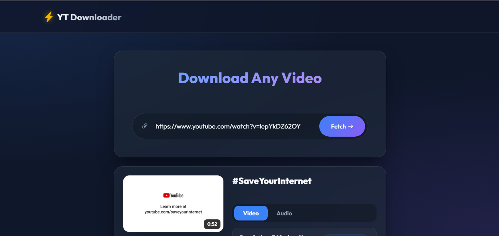

<!-- markdownlint-disable MD033 MD041 -->
<div align="center">

# 🎬 Youtube Downloader

<p align="center">

</p>


[](https://developer.mozilla.org/en-US/docs/Web/HTML)
[](https://developer.mozilla.org/en-US/docs/Web/CSS)
[](https://developer.mozilla.org/en-US/docs/Web/JavaScript)
[](https://python.org)
[](https://flask.palletsprojects.com/)
[](https://fastapi.tiangolo.com)
[](https://vercel.com)

[](https://github.com/Blue-Rangoon/Smart-Delivery-Route-Planner-AI/commits/main)
[](https://github.com/Blue-Rangoon/Smart-Delivery-Route-Planner-AI/stargazers)
[](https://github.com/Blue-Rangoon/Smart-Delivery-Route-Planner-AI/graphs/contributors)
[](LICENSE)
[](https://github.com/Blue-Rangoon/Smart-Delivery-Route-Planner-AI)

</div>




---

## About The Project

A fast and lightweight YouTube video downloader built with Flask. This application allows users to download videos and audio directly from YouTube in multiple formats and resolutions, including **MP4 (HD)** and **MP3**.

Designed for simplicity and speed, the YouTube Downloader provides a clean interface where users can paste a video link and instantly download content for offline use. It ensures high-quality downloads, quick processing, and a smooth user experience.

Whether you want to save tutorials, music, or videos for offline viewing, this tool makes the process effortless and efficient.

> 💡 **Live Demo:** [YouTube Downloader](https://youtube-downloader-civics.vercel.app/) *(Live Website)*


## ⭐ Repository Visitors

<div align="center">


*Thank you for visiting! If you find this project useful, please consider giving it a ⭐*

</div>

---


## ✨ Features

- 🔍 **Search & Extract** - Fetch video metadata (title, thumbnail, duration, uploader)
- 🎥 **Video Downloads** - Download videos in multiple quality formats (MP4)
- 🎵 **Audio Downloads** - Download audio-only formats (M4A, MP3)
- 🍪 **Cookie Support** - Optional authentication via cookies.txt for private videos
- ☁️ **Cloud Ready** - Deployable to Vercel with zero configuration
- 🌐 **Cross-Platform** - Works on Windows, macOS, and Linux

## 🛠️ Tech Stack

| Technology | Description |
|------------|-------------|
| **Python 3.8+** | Backend runtime |
| **Flask 2.3.3** | Web framework |
| **yt-dlp** | YouTube downloader library |
| **HTML/CSS/JS** | Frontend UI |

## 📋 Prerequisites

Before installing, make sure you have:

- Python 3.8 or higher installed
- pip package manager

```bash
python --version
pip --version
```

## 🚀 Installation

### 1. Clone the Repository

```bash
git clone https://github.com/Blue-Rangoon/youtube-downloader.git
cd youtube-downloader
```

### 2. Create Virtual Environment (Recommended)

```bash
# Windows
python -m venv venv
venv\Scripts\activate

# macOS/Linux
python -m venv venv
source venv/bin/activate
```

### 3. Install Dependencies

```bash
pip install Flask==2.3.3 yt-dlp
```

Or install all requirements at once:

```bash
pip install -r requirements.txt
```

### 4. (Optional) Add Cookies for Private Videos

If downloading private or age-restricted videos:

1. Export cookies from your browser as `cookies.txt`
2. Place the file in the project root directory

```
youtube-downloader/
├── cookies.txt    # Optional
├── requirements.txt
├── api/
└── ...
```

### 5. Run the Application

```bash
cd api
python app.py
```

Open your browser and visit: `http://localhost:5000`

## 📖 Usage

### Using the Web Interface

1. Enter a YouTube video URL
2. Click the search button
3. Select your desired quality format
4. Download the video or audio

### Using the API

```bash
# Check if server is running
curl http://localhost:5000/

# Download video info
curl -X POST http://localhost:5000/download \
  -H "Content-Type: application/json" \
  -d '{"url":"https://www.youtube.com/watch?v=dQw4w9WgXcQ"}'
```

**Example Response:**

```json
{
  "title": "Rick Astley - Never Gonna Give You Up",
  "thumbnail": "https://i.ytimg.com/vi/dQw4w9WgXcQ/maxresdefault.jpg",
  "duration": 213,
  "uploader": "RickAstleyVEVO",
  "videos": [
    {
      "quality": "1080p",
      "format_id": "137",
      "ext": "mp4",
      "filesize": null
    }
  ],
  "audios": [
    {
      "quality": 128,
      "format_id": "140",
      "ext": "m4a",
      "filesize": null
    }
  ],
  "platform": "YouTube"
}
```

## ☁️ Deployment to Vercel

This project is configured for Vercel deployment:

```bash
# Install Vercel CLI
npm i -g vercel

# Deploy
vercel
```

Or connect your GitHub repository to Vercel for automatic deployments.

## 📁 Project Structure

```
youtube-downloader/
├── api/
│   └── app.py              # Main Flask application
├── static/
│   ├── index.css          # Styling
│   └── index.js           # Frontend logic
├── templates/
│   └── index.html         # User interface
├── vercel.json            # Vercel configuration
├── requirements.txt       # Python dependencies
├── .gitignore             # Git ignore rules
└── README.md              # This file
```

## 🔧 Configuration

### Changing Port

Edit `api/app.py`:

```python
app.run(port=5000, debug=True)
```

### yt-dlp Options

Modify `ydl_opts` in `api/app.py`:

```python
ydl_opts = {
    "quiet": True,
    "skip_download": True,
    "extractor_args": {"youtube": ["client=android,web"]}
}
```

## 🤝 Contributing

Contributions are welcome! Please feel free to submit a Pull Request.

1. Fork the repository
2. Create your feature branch (`git checkout -b feature/amazing-feature`)
3. Commit your changes (`git commit -m 'Add some amazing feature'`)
4. Push to the branch (`git push origin feature/amazing-feature`)
5. Open a Pull Request

## 📄 License

This project is licensed under the MIT License - see the [LICENSE](LICENSE) file for details.

## ⚠️ Disclaimer

This tool is for educational purposes only. Please respect YouTube's Terms of Service and only download content you have the right to download.

---

<div align="center">

**Made with ❤️ by [Saad Ali Rizvi](https://github.com/Blue-Rangoon)**

[](https://github.com/Blue-Rangoon)
[](https://linkedin.com/in/saad-ali-rizvi/)
</div>
